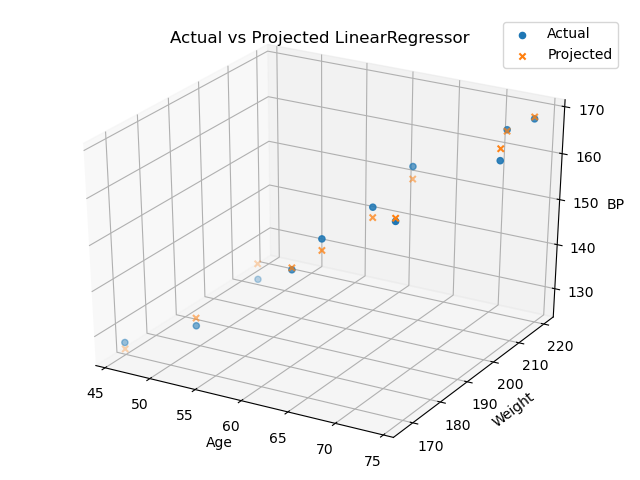

Linear Regresssion with scikit-learn

## Dataset
The simple cengage systolic blood pressure dataset:  
https://college.cengage.com/mathematics/brase/understandable_statistics/7e/students/datasets/mlr/frames/frame.html

## Purpose
Since I implemented linear regression from scratch,  
this is to see if scikit-learn can make it simple

#### Run verified with python 3.7 and numpy 1.18.1
python Runner.py

## Predicted vs Actual

## Prediction Results over the Training set

Mean Absolute Loss:  1.64  

|Age|Weight|Actual Blood Pressure|Predicted Blood Pressure|Loss|
|:-------:|:---:|:--------------------:|:---------------------:|:----:|
|52.0|173.0|132.0|134.0|2.0|
|59.0|184.0|143.0|143.0|0.0|
|67.0|194.0|153.0|154.0|1.0|
|73.0|211.0|162.0|165.0|3.0|
|64.0|196.0|154.0|152.0|2.0|
|74.0|220.0|168.0|168.0|0.0|
|54.0|188.0|137.0|140.0|3.0|
|61.0|188.0|149.0|146.0|3.0|
|65.0|207.0|159.0|156.0|3.0|
|46.0|167.0|128.0|127.0|1.0|
|72.0|217.0|166.0|166.0|0.0|

